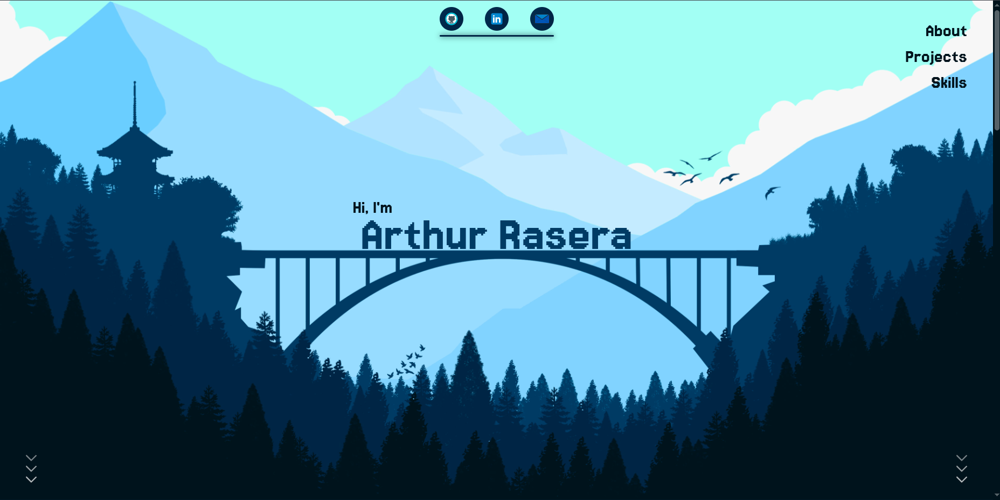

  <a href="https://github.com/Raseraa0">
   🏠 Go back to my GitHub home page 🏠 
  </a>

---

# 📌 Portfolio

## 📝 Overview

Portfolio deployed on `GitHub Pages`. The main idea behind this portfolio was to use the `parallax` effect. I decided to use an image from the game Firewatch and build my color palette around it. I created the different parallax layers myself.

This site is animated and responsive, but nothing beats visiting it to see for yourself.
- 🚀 [Go to my portfolio](https://raseraa0.github.io)

## 🧰 Toolbox

- Node.js  
- React.js  
- Next.js  
- TypeScript  
- Tailwind.css  

---

  <a href="https://github.com/Raseraa0">
   🏠 Go back to my GitHub home page 🏠 
  </a>

